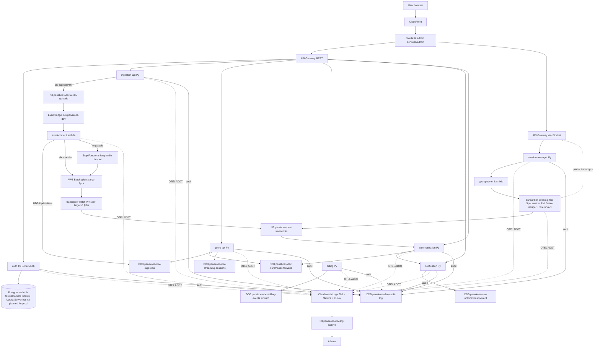

# Panakoes Architecture

Comprehensive architecture reference for Panakoes. This file pulls together every locked decision, every service, the data flow, and the AWS infrastructure map.

`CLAUDE.md` at the repo root is the source of truth for locked decisions; this document re-states them in operational form. When a decision changes, update `CLAUDE.md` first, then this file in the same PR.

---

## 1. Project context

Panakoes is the cloud audio capture, transcription, and insights platform for LaFayette Labs LLC (filed 2026-04-23). It ingests audio (uploaded files or live wearable streams), transcribes it with Whisper-class models on GPU compute, summarizes the result with Claude, and exposes a self-service dashboard plus API. The project is open-source under MIT, public on Phil's personal GitHub at `panakoes`, and serves three concrete purposes per `CLAUDE.md`: (1) the first open-source initiative under LaFayette Labs LLC; (2) the cloud backend for an upcoming AI wearable (a Plaud Note Pro competitor that forks BasedHardware's Omi); (3) a portfolio piece demonstrating AWS solutions-architect depth for Phil's senior-level job search. The project name is constructed Greek for "all-hearing", a deliberate parallel to Argus Panoptes ("all-seeing"). Domains [lafayettelabs.com](https://lafayettelabs.com) and [panakoes.com](https://panakoes.com) are registered at Cloudflare.

---

## 2. High-level architecture

Event-driven microservices on AWS in `us-east-1`. The two main request paths are the synchronous user/admin path (browser to API) and the asynchronous transcription pipeline (S3 upload to summary). The streaming path is its own WebSocket lane.



Key flows in prose:

- **Async transcription.** Client calls `POST /ingestion/audio` on the Ingestion API and receives a pre-signed S3 PUT URL. Browser PUTs the audio object at `audio/{user_id}/{ingestion_id}/{filename}`. The S3 `ObjectCreated` event hits EventBridge and the `event-router` Lambda flips `status=pending` to `status=uploaded` (conditional update, idempotent), then publishes a `panakoes.ingest / AudioUploaded` event. Files under 10 minutes go straight to AWS Batch on a g4dn.xlarge Spot GPU running Whisper-large-v3 fp16. Files over 10 minutes route through Step Functions for fan-out chunking, bypassing Lambda's 15-minute ceiling (per ADR-012). Output transcript JSON lands in the transcripts bucket; the Summarization service reads it, calls Claude, and writes a Summary record.
- **Live streaming.** Client opens a WebSocket against API Gateway. Session Manager creates a `streaming-sessions` record, calls the GPU Spawner Lambda which runs `ec2:RunInstances` against the custom AMI (NVIDIA + Docker + faster-whisper + Whisper-large weights pre-baked). The instance pulls the latest container layer, attaches to the WebSocket, and streams partial transcripts via Silero VAD-segmented inference. Idle timeout reaper terminates the GPU; teardown writes the final transcript to S3.
- **Read path.** Client/admin calls `query-api` for ingestion records, summaries, and session history. Same auth (HS256 JWT today, RS256+JWKS planned per ADR-022).
- **Audit/observability.** Every service emits OpenTelemetry traces, metrics, and logs via the AWS Distro for OpenTelemetry (ADOT) into CloudWatch + X-Ray (per ADR-015). Every domain action also lands in DynamoDB via the `panakoes-audit` library (per ADR-023). CloudWatch Logs lifecycle to S3 at 30 days; S3 archive is queryable via Athena (per ADR-016).

---

## 3. Service catalog

Status legend: **shipped** = deployed-ready, tests passing, lives on `main`; **skeleton** = scaffold + tests, awaiting business logic; **pending** = not yet implemented (forward-referenced in IAM, ECR, and event wiring).

| Service | Stack | Status | One-line |
|---|---|---|---|
| `auth` | TS, Hono 4, Better-Auth, Drizzle, jose | shipped | Issues HS256 JWTs (1h expiry) backed by Postgres-managed sessions; `/auth/validate` for service-to-service freshness checks. See `services/auth/README.md`. |
| `ingestion-api` | Py, FastAPI, boto3 | shipped | Authenticated pre-signed S3 PUT URL minting + ingestion intent records in DDB. Object key shape `audio/{user_id}/{ingestion_id}/{filename}`. |
| `query-api` | Py, FastAPI, boto3 | shipped | Unified read API over a user's ingestions, summaries, and streaming sessions. Returns 404 (not 403) on cross-user access to avoid leaking record existence. |
| `event-router` | Py, Lambda (container image, base `public.ecr.aws/lambda/python:3.12`) | shipped | Routes S3 `ObjectCreated` events: flips ingestion status from pending to uploaded, then publishes `panakoes.ingest / AudioUploaded` to EventBridge. Idempotent via DDB conditional updates. |
| `transcribe-worker` | Py, Lambda (container image, base `public.ecr.aws/lambda/python:3.12`) | shipped | SQS-driven auto-trigger: consumes EventBridge-fanned S3 ObjectCreated events and calls ingestion-api's `transcribe_ingestion` orchestration. Single-sourced with the on-demand `POST /api/v1/transcribe/{id}` route. Provisioned by `infra/dev/transcribe-worker`. |
| `summarization` | Py, FastAPI, Anthropic SDK | shipped | Reads transcript from S3, calls Claude Haiku 4.5 (default) or Sonnet 4.6 (paid "deep summary" tier per ADR-013), writes Summary record to S3 + DDB. JWT-validated, owner-scoped (404 on cross-user). Tier authorization (gating Sonnet behind paid plan) is a documented follow-up. |
| `notification` | Py, FastAPI, boto3 SES + httpx | shipped | Email (SES) and HTTPS webhook fan-out with Jinja2 templates and DDB-backed history. Webhook delivery has 3-attempt exponential backoff. HTTP-only URLs rejected with 400. JWT-validated, owner-scoped. |
| `session-manager` | Py, FastAPI, boto3 | shipped | WebSocket session lifecycle: create, status transitions (starting/active/paused/completed/errored), idle-timeout reap via TTL, graceful teardown. Persists state in `panakoes-dev-streaming-sessions`. JWT-validated, owner-scoped. |
| `gpu-spawner` | Py, Lambda | pending | Calls `ec2:RunInstances` against the custom Packer AMI to spawn per-session GPU. Tag-gated and instance-type-gated in IAM (per `infra/dev/iam/README.md`). |
| `transcriber-batch` | Py, AWS Batch container, Whisper-large-v3 fp16 | pending | Async transcription job. Pulls audio from S3, writes transcript JSON to S3, updates DDB. ECR repo + IAM role pre-provisioned. |
| `transcriber-stream` | Py, container baked into custom AMI, faster-whisper-large + Silero VAD | pending | Streaming transcription on the spawned GPU. Reports partials to the session-manager via WebSocket; finalizes to S3 on close. |
| `billing` | Py, Lambda | skeleton (`feat/billing-skeleton` branch) | Stripe checkout sessions, webhook handler with idempotency, subscription state writes to DDB `panakoes-dev-billing-events` (per ADR-014: Free / Pro $12mo / Team $30/seat min 3). |
| `admin` (frontend) | TS, SvelteKit on S3 + CloudFront | pending (`feat/svelte-admin-skeleton` branch) | Public marketing landing + authenticated user views (upload, transcript list, transcript detail, billing) + role-gated `/admin` Tier 1+2+3 dashboard (per `SCOPE.md`). |

Languages follow ADR-008: Python primary across services, TypeScript for `auth` and the frontend. Every Python service starts from `services/_template/` (FastAPI + structlog + uv + ruff + mypy strict + pytest).

---

## 4. Shared libraries

Path-dependency monorepo libraries imported by services. Versioned together with the services that consume them; a breaking change is one PR that updates the lib and every consumer.

| Library | Path | Purpose | Consumers |
|---|---|---|---|
| `panakoes-audit` | `services/audit-lib/` | Pluggable audit-event recording. Three backends (Memory, Stdout, DynamoDB) behind one `AuditStore` Protocol, selected by `AUDIT_BACKEND` env var (per ADR-023). 100% coverage gate. Public surface: `AuditEvent`, `record_event`, `set_store`, `reset_store`, three `AuditStore` classes. | Every Python service. |
| `panakoes-auth-client` | `services/auth-client/` | Python-side JWT verifier with `JwtValidator`, `from_env()`, `fastapi_dependency()`, `JwtClaims` model, and explicit `JwtInvalidError`/`JwtConfigError` types. HS256 today, will swap to RS256+JWKS per ADR-022 in slice 2. 100% coverage. | Every Python service that authenticates inbound HTTP. |
| `panakoes-models` | `services/models-lib/` | Shared Pydantic v2 models for cross-service contracts: `User`, `IngestionRecord`, `Transcript`, `Summary`, `StreamingSession`, `NotificationRecord`, `Subscription`, `ApiError`. `frozen=True`, `extra="forbid"`, UTC-only timestamps. 100% coverage. | Every Python service that touches a domain object. |
| `panakoes-middleware` | `services/middleware-lib/` | Cross-cutting FastAPI middleware: rate-limit (sliding-window with InMemoryStore + RedisStore), CORS allowlist, request size + required-headers validation, correlation-id propagation, audit-event decorator. 100% coverage. | Every Python HTTP service. |
| `panakoes-otel` | `services/otel-lib/` | Single-call OTel bootstrap: `configure(service_name, environment)` wires TracerProvider + MeterProvider + LoggerProvider, OTLP/gRPC exporters, W3C TraceContext, resource attributes (`service.namespace=panakoes`). Auto-instrumentation helpers for FastAPI, boto3, httpx. NoOp providers when `OTEL_SDK_DISABLED=true`. | Every Python service. |
| `@panakoes/otel` | `services/otel-lib-ts/` | TypeScript counterpart to `panakoes-otel`. Same resource convention, OTLP/gRPC export, NodeSDK auto-instrumentations, manual W3C trace-context middleware for Hono. | `auth` service and any future TS service. |
| `panakoes-test-helpers` | `services/test-helpers/` | Shared pytest helpers: JWT mint (`make_test_token`, `make_expired_token`, `bearer_header`), moto-backed S3/DDB/EventBridge fixtures, factory functions for User/IngestionRecord/Summary/StreamingSession. | Every Python service's test suite. |

Libraries declare each consuming service in `pyproject.toml` via path dep:

```toml
[project]
dependencies = ["panakoes-models @ file:../models-lib"]

[tool.uv.sources]
panakoes-models = { path = "../models-lib", editable = true }
```

---

## 5. AWS infrastructure map

Terraform modules under `infra/`. State lives in S3 with KMS encryption + DynamoDB lock per ADR-004 and ADR-020. State key per module is `<env>/<module>/terraform.tfstate`. Apply ordering is documented in each module's README. See `infra/README.md` for the full layout.

### Bootstrap

`infra/bootstrap/` provisions the Terraform remote-state backend itself: the S3 bucket, the KMS CMK encrypting state, and the DynamoDB lock table. This is the only module that uses LOCAL Terraform state, deliberately, because the S3 backend cannot exist before something creates it. State file is gitignored. Applied once per AWS account; outputs feed every subsequent `backend "s3"` block.

### Global

`infra/global/` is account-wide and region-agnostic. Provisions the GitHub Actions OIDC identity provider and the IAM role the `panakoes` repo's workflows assume. Trust policy currently scopes to `repo:Aztec03hub/panakoes` (any branch); tightening to `ref:refs/heads/main` and explicit GitHub environments is a documented follow-up. Permission policy is `AdministratorAccess` for early dev velocity; least-privilege scoping is queued for before any production usage. **Applied.**

### Per-environment dev modules

All dev modules live under `infra/dev/`. State key prefix is `dev/<module>/terraform.tfstate`. Resources tagged `Project=panakoes`, `Environment=dev`, `ManagedBy=terraform`, `Module=<module>`.

- **`dev/network/`**. VPC `panakoes-dev` (CIDR `10.10.0.0/16`), 3 public + 3 private subnets across `us-east-1a/b/c`, single NAT Gateway in `us-east-1a` (cost discipline; multi-AZ NAT planned for prod), Internet Gateway, locked-down default security group, VPC Flow Logs to CloudWatch with 30-day retention. Built from `terraform-aws-modules/vpc/aws ~> 5.21`. **Plan-clean** (apply pending; no dev AWS resources have been provisioned yet, only `bootstrap/` and `global/`).
- **`dev/storage/`**. Three S3 buckets: `panakoes-dev-audio-uploads-<suffix>` (CORS-enabled for browser PUT to pre-signed URLs), `panakoes-dev-transcripts-<suffix>` (Lambda-only writes, API-only reads), `panakoes-dev-log-archive-<suffix>` (7-year retention for Athena). Per-bucket KMS CMK (`alias/panakoes-dev-<bucket>`), versioning, public-access blocked, TLS-only policy. Lifecycle rules tier audio uploads to IA at 30d, transcripts to GLACIER_IR at 180d, log archive through IA → GLACIER_IR → DEEP_ARCHIVE → expire at 7y. **Plan-clean.**
- **`dev/data/`**. Three DynamoDB tables, all `PAY_PER_REQUEST`, SSE on, point-in-time recovery, deletion protection. `panakoes-dev-ingestion` (PK `USER#{user_id}`, SK `INGESTION#{ingestion_id}`, GSIs `IngestionIdIndex` and `StatusIndex`, 30-day TTL on abandoned uploads). `panakoes-dev-audit-log` (PK `AUDIT#{source_service}#{actor_id}`, SK `{timestamp_iso}#{request_id}`, GSIs `ActionIndex` and `ActorIndex`, no TTL). `panakoes-dev-streaming-sessions` (PK `session_id`, GSIs `UserSessionsIndex` and `ActiveSessionsIndex`, 24h TTL post session-end). **Plan-clean.**
- **`dev/secrets/`**. Single CMK `alias/panakoes-dev-secrets` plus seven Secrets Manager secrets: `jwt-signing-secret`, `anthropic-api-key`, `stripe-test-key`, `stripe-webhook-signing-secret`, `postgres-auth-db-password`, `database-url`, `ses-smtp-credentials`. All created with placeholder values; real values written post-apply via `aws secretsmanager put-secret-value` (so they never enter Terraform state, plan output, or git). `lifecycle.ignore_changes = [secret_string]` keeps Terraform off the values forever after. **Plan-only** (waiting on IAM consumers to land in the same sweep so resource-based policies can attach atomically).
- **`dev/ecr/`**. Eleven ECR repositories (`panakoes-dev-<service>` for auth, billing, event-router, gpu-spawner, ingestion-api, notification, query-api, session-manager, summarization, transcriber-batch, transcriber-stream). Single shared CMK `alias/panakoes-dev-ecr`, `IMMUTABLE` tag mutability, scan-on-push, lifecycle keep-last-10-tagged + expire-untagged-after-14-days. **Plan-only** (init done, apply queued behind credentials sweep).
- **`dev/observability/`**. CloudWatch log groups per service with 30-day retention, dashboards (service tiles, error rate, latency, GPU utilization), and SNS topic `panakoes-dev-system-alerts` for alarm fan-out. Lifecycle subscription filter ships logs to the `log-archive` S3 bucket for Athena. **Plan-only** (branch `feat/dev-observability`).
- **`dev/events/`**. Custom EventBridge bus `panakoes-dev` plus rules routing `panakoes.ingest / AudioUploaded` to downstream Lambdas (transcriber-batch trigger, Step Functions for long audio). DLQ per rule. **Plan-only** (branch `feat/dev-events`).
- **`dev/iam/`**. Per-service least-privilege IAM roles (eleven task roles + seven ECS execution roles + one GPU instance role/profile). Every policy uses explicit Resource ARNs and condition keys (`aws:PrincipalArn`, `aws:RequestTag`, `ec2:InstanceType`, `ses:FromAddress`, `cloudwatch:namespace`). The `iam:PassRole` on `gpu-spawner` is pinned to the specific GPU instance role, never `*`. See `infra/dev/iam/README.md` for the per-service permission matrix. **Plan-only** (branch `feat/dev-iam`).
- **`dev/vpc-endpoints/`**. Interface endpoints for `secretsmanager`, `kms`, `ecr.api`, `ecr.dkr`, `logs`, plus free Gateway endpoints for `s3` and `dynamodb`. Cuts NAT Gateway data charges once the transcription pipeline starts pulling Whisper container layers through ECR. **Plan-only** (branch `feat/dev-vpc-endpoints`).
- **`dev/waf/`**. AWS WAFv2 web ACL fronting the CloudFront distribution and the API Gateway: AWS-managed core rule set, rate-based rule (per-IP), bot control basic, geo-block list. **Plan-only** (branch `feat/dev-waf`).
- **`dev/backup/`**. AWS Backup vault `panakoes-dev` plus a `panakoes-dev-daily-monthly` plan with two rules (daily 5am UTC retention 30d; monthly 5am UTC on the 1st retention 365d). Selection covers all DDB tables tagged `Backup=enabled` plus explicitly-listed table ARNs. KMS CMK `alias/panakoes-dev-backup`. Cross-account copy not yet wired. **Plan-clean.**
- **`dev/batch/`** (in flight). AWS Batch compute environment for async transcription. `panakoes-dev-transcribe` MANAGED env on `g4dn.xlarge` Spot, allocation strategy `SPOT_CAPACITY_OPTIMIZED`, scales 0 to 16 vCPU. Job Queue `panakoes-dev-transcribe-queue` priority 1. Job Definition `panakoes-dev-transcribe-batch` (container, 4 vCPU, 15 GB RAM, 1 GPU, ECR image from `dev/ecr`). CloudWatch alarm on FailedJobs > 0.
- **`dev/step-functions/`** (in flight). Step Functions STANDARD state machine for the long-audio fan-out pipeline (per ADR-012). DetectDuration → Choice → ChunkAudio → Map(parallel transcribe) → MergeTranscripts → WriteFinalTranscript with retry/catch on every task. Logging to a KMS-encrypted CloudWatch Logs group with `ALL` level + execution data.
- **`dev/api-gateway/`** (in flight). Single HTTP API `panakoes-dev-public` fronting every microservice. CORS for `panakoes.com`, `lafayettelabs.com`, and `localhost:5173`. VPC Link to private subnets. WAF web ACL associated. Routes per service catalog. CloudWatch alarms on 4xx/5xx rate and integration latency p99.
- **`dev/frontend/`** (in flight). CloudFront distribution + private S3 origin via OAC for the SvelteKit admin app. SPA fallback (403/404 → /index.html). PriceClass_100 (US/Europe). Logging bucket with 90-day retention. WAFv2 web ACL associated.
- **`infra/ami/gpu-transcribe/`** (in flight). Packer template producing the custom GPU AMI baked with Whisper-large-v3 fp16 + faster-whisper-large + Silero VAD weights. Built from the Deep Learning AMI GPU PyTorch base. Tagged `Project=panakoes`, `Environment=dev`, `BakedAt=<timestamp>` for inventory.

### Not yet modeled

ECS cluster + Fargate services, Lambda function modules (each service's Terraform Lambda block), RDS or Aurora-Serverless-v2 for auth in prod, ACM certificate + Route 53 records (custom domains for the API Gateway and CloudFront). These land in subsequent slices; the IAM and ECR modules already forward-reference them via explicit ARN construction so policies stay tight from day zero.

---

## 6. Auth and authorization model

Per ADR-005 and ADR-022. Two signing schemes phased over the project's life.

**Slice 1 (today): HS256 with an env-driven shared secret.** The auth service signs with `AUTH_JWT_SECRET` (zod-validated to be at least 32 bytes at startup; service refuses to boot otherwise). Every consuming Python service reads the same secret from its own env (sourced from AWS Secrets Manager `panakoes-dev/jwt-signing-secret` at runtime, never committed) and validates locally via `python-jose` or equivalent. Tokens carry `{sub, email, iat, exp, jti, iss=https://auth.panakoes.com, aud=panakoes-api}`. The `jti` is the session UUID; `/auth/validate` confirms session freshness when callers need real-time accuracy beyond the 1-hour token window.

**Slice 2 (planned): RS256 with a JWKS endpoint.** Auth service holds an RSA key pair; `/.well-known/jwks.json` exposes the public half. Verifiers fetch and cache the JWKS, validate `kid`, and verify signatures with the public key. Key rotation is `kid`-stamped publish-then-flip-then-retire. Migration is a coordinated cut: dual-publish JWKS while still signing HS256 for one window, then flip to RS256.

**Roles.** Better-Auth manages `user` and `admin` roles. Admin role gates `/admin` routes in the SvelteKit frontend and the admin API.

**Step-up MFA.** Tier 3 admin actions (lifecycle controls: restart, scale, kill stuck session, drain Batch, kill-switch, replay) require step-up MFA in addition to the admin role. Wiring is queued behind Better-Auth's MFA primitives.

**Service-to-service tokens.** Cross-service calls carry an `actor_type` claim (`user` | `service` | `system` | `anonymous`) that the audit log records as the actor type. The `panakoes-audit` library's `AuditEvent.actor_type` mirrors this claim. Services validating service tokens reject `user` actor_type on internal endpoints to prevent confused-deputy scenarios.

The Python verifier lives in `panakoes-auth-client` (slice 1: HS256; slice 2 will swap implementations behind the same import surface).

---

## 7. Data architecture

### DynamoDB tables (PAY_PER_REQUEST per ADR; cost discipline, no provisioned-capacity tier-up)

- **`panakoes-dev-ingestion`**. Ingestion intent records. PK `USER#{user_id}`, SK `INGESTION#{ingestion_id}`. GSI `IngestionIdIndex` (lookup by id; GSIs needed because callbacks/webhooks arrive with only the ingestion_id), GSI `StatusIndex` (KEYS_ONLY projection, retry/monitoring worker enumeration). 30-day TTL on abandoned uploads.
- **`panakoes-dev-audit-log`**. Application audit events written by the `panakoes-audit` library (per ADR-023). PK `AUDIT#{source_service}#{actor_id}`, SK `{timestamp_iso}#{request_id}` (ISO-8601 prefix gives free chronological ordering inside each partition). GSI `ActionIndex` (find all events with a given action across actors and services; compliance + incident review), GSI `ActorIndex` (full audit trail for a single actor across services; support workflows). No TTL; audit retention is forever. A future config will attach a DynamoDB Stream and ship aged events to S3 for long-term Athena-queryable archive.
- **`panakoes-dev-streaming-sessions`**. Live transcription session state. PK `session_id`. GSI `UserSessionsIndex` (dashboard "my recent sessions"), GSI `ActiveSessionsIndex` (KEYS_ONLY, idle-timeout reaper enumeration). 24h TTL post session end.
- **`panakoes-dev-summaries`** (forward) , PK `USER#{user_id}`, SK `SUMMARY#{transcript_id}`. Provisioned by the Summarization service config when it lands.
- **`panakoes-dev-notifications`** (forward) , Notification fan-out state. Provisioned by the Notification service config.
- **`panakoes-dev-billing-events`** (forward) , Stripe webhook event ledger with idempotency keys. Provisioned by the Billing service config.

### Postgres

The `auth` service uses a relational store for Better-Auth's four tables (`user`, `session`, `account`, `verification`; `account` holds the Argon2id password hash). In tests this is a real Postgres 16 spun up via testcontainers (no DB mocks per ADR-018). In production this will be Aurora Serverless v2 (auto-scaling, lower idle cost than provisioned RDS) in the same VPC as the auth service ECS task. Database URL and password sourced from Secrets Manager (`panakoes-dev/database-url`, `panakoes-dev/postgres-auth-db-password`).

### S3 buckets

Three buckets, each KMS-encrypted with a dedicated CMK to scope blast radius per-bucket without granting cross-bucket access.

- **`panakoes-dev-audio-uploads-<suffix>`**. Raw audio uploaded by clients via pre-signed PUT URLs. CORS enabled for the public-facing domains. Object key `audio/{user_id}/{ingestion_id}/{filename}` (sanitized filename: ASCII alphanum, hyphen, dot, underscore). Lifecycle: STANDARD with IA at 30d, expire noncurrent at 90d.
- **`panakoes-dev-transcripts-<suffix>`**. Transcript JSON output. Lifecycle: STANDARD → IA at 60d → GLACIER_IR at 180d → kept indefinitely. Small JSON, rarely re-read once surfaced in the API.
- **`panakoes-dev-log-archive-<suffix>`**. Long-term log archive feeding Athena (per ADR-016). Lifecycle: STANDARD → IA at 30d → GLACIER_IR at 90d → DEEP_ARCHIVE at 180d → expire at 7y.

Bucket key (`bucket-key-enabled`) is on for every bucket so S3 amortizes encryption requests at the bucket level rather than per-object, keeping KMS request volume bounded under heavy upload bursts.

---

## 8. Observability and audit

Per ADR-015 and ADR-016 (observability/logging) and ADR-017 + ADR-023 (audit).

**Telemetry.** Every service instruments with OpenTelemetry on startup via `panakoes-otel` (Python) or `@panakoes/otel` (TypeScript). The OTLP/gRPC exporter targets the AWS Distro for OpenTelemetry (ADOT) collector, which fans out to CloudWatch Metrics + Logs and AWS X-Ray. Lambda functions get the ADOT layer; ECS tasks get the ADOT sidecar. Resource attributes (`service.name`, `service.namespace=panakoes`, `service.version`, `deployment.environment`) are stamped on every span/metric/log so dashboards and alarms can group consistently.

**Trace propagation.** W3C TraceContext crosses HTTP, EventBridge, SQS, and WebSocket boundaries. A trace started at the SvelteKit frontend continues through the API Gateway, the ingestion-api, the S3 upload event, the event-router Lambda, the AWS Batch job, the summarization service, and back out to the user via the notification service.

**Logs.** CloudWatch Logs with 30-day retention. A subscription filter ships logs to `panakoes-dev-log-archive-<suffix>` after the retention window; AWS Glue catalog + Athena make long-tail logs queryable at any timescale. Cost stays bounded because hot retention is short and cold archive is GLACIER tiers.

**Metrics + alarms.** Per-service CloudWatch metrics (latency, error rate, throughput, custom domain metrics like `panakoes/transcribe` namespace from the GPU workers). Alarms publish to the SNS topic `panakoes-dev-system-alerts`; the `incident-response.md` runbook covers detect-triage-mitigate.

**Audit trail (split per ADR-023).**

- Application-level events through the `panakoes-audit` library into DDB `panakoes-dev-audit-log`. Three pluggable backends (Memory, Stdout, DynamoDB) selected by `AUDIT_BACKEND` env var: tests use Memory, local dev uses Stdout, deployed environments use DynamoDB. The `AuditEvent` Pydantic model is the single schema across backends. 100% coverage gate per ADR-018.
- AWS-API-level events through CloudTrail (management events). Together with the application audit log, the two streams form complete coverage: CloudTrail tells us what AWS calls were made by which IAM principal; the application log tells us what domain actions were taken on behalf of which user.

---

## 9. Cost discipline

The project ships on AWS Activate Founders credits ($1,000 applied for; sufficient for ~10 years of expected dev streaming usage per ADR-009).

- **Region.** `us-east-1` only (per ADR-003: cheapest, widest service coverage).
- **NAT Gateway.** Single NAT in `us-east-1a` for dev (~$32/mo) instead of multi-AZ (~$96/mo). Multi-AZ NAT is a one-line flip for prod (`single_nat_gateway = false`, `one_nat_gateway_per_az = true`).
- **GPU compute.** g4dn.xlarge **Spot** for both async batch and streaming (per ADR-010). On-demand price is roughly $0.526/hr; Spot is roughly $0.16/hr at typical interruption rates. Streaming sessions are session-spawned (per ADR-011), not always-on, so idle cost is near zero.
- **DynamoDB.** PAY_PER_REQUEST on every table (per `infra/dev/data/README.md`). At dev volumes this is pennies per month; no provisioned-capacity tier-up cost. Production scale-up to PROVISIONED with auto-scaling is a Terraform diff, not a rewrite.
- **S3 lifecycle.** STANDARD → IA → GLACIER_IR → DEEP_ARCHIVE → expire, tuned per bucket access pattern. The log archive hits DEEP_ARCHIVE at 180d and expires at 7y; transcripts stay warm but tier to GLACIER_IR at 180d.
- **KMS.** $1/month per CMK; per-bucket and per-domain CMKs trade key-cost for blast-radius isolation. ECR uses a single shared CMK because container images are application binaries, not regulated data; storage and secrets use per-bucket and per-secret CMKs because their threat model is different.
- **Observability.** CloudWatch + X-Ray free tier covers all dev usage; steady-state cost at production scale projected at $5-15/mo (per ADR-015), an order of magnitude under Datadog or paid Grafana.
- **Secrets Manager.** $0.40/secret/mo (~$2.80/mo for the seven dev secrets) plus negligible request charges with in-process caching.

---

## 10. Security posture

Per ADR-020. Public repo on Phil's personal GitHub; "no secrets in source" is necessary but not sufficient. Defense in depth.

- **License + repo.** MIT (per ADR-002). Branch protection on `main` (required PRs, required CI checks, no force-push, linear history). Required approvals on `main` is 0 (GitHub blocks self-approval at platform level for solo dev; discipline preserved via required PR + status checks + linear history per the Panakoes PR workflow memory entry).
- **Secrets handling.**
  - `gitleaks` pre-commit hook + GitHub server-side secret scanning + push protection (free for public repos).
  - All credentials in AWS Secrets Manager / SSM Parameter Store at runtime; cached in process memory to keep `GetSecretValue` charges bounded.
  - `.gitignore` blocks `.env`, `.env.*`, `*.tfstate`, `*.terraform/`, `*.pem`, `*.key`.
- **Terraform state.** Remote in S3, KMS-encrypted, DynamoDB-locked (per ADR-004 and ADR-020). State files never in repo; bootstrap module's local state is the one exception and is itself gitignored.
- **CI/CD credentials.** GitHub Actions to AWS via OIDC federation (per `infra/global/`). No long-lived AWS access keys anywhere. The trust policy on the OIDC role currently scopes by repo; tightening to `ref:refs/heads/main` and per-environment scoping is a documented follow-up.
- **IAM (per `infra/dev/iam/README.md`).** Per-service task roles (eleven), per-ECS-service execution roles (seven), GPU instance role + profile. Every policy uses explicit Resource ARNs (no `Resource = "*"` except where the AWS API has no resource-level authz, in which case condition keys tighten the grant). `query-api` is the clearest illustration: read-only `dynamodb:Query / GetItem / BatchGetItem` and nothing else, even though it shares tables with services that write.
- **KMS CMKs (per-domain).** Storage (per-bucket), data (DDB uses AWS-managed key today; flips to CMK if internal-AWS read access becomes a threat-model concern), secrets, ecr (single shared), logs (planned), waf (planned), backup (planned). Rotation enabled on every key.
- **Pre-commit hardening.** gitleaks + standard hygiene hooks (trailing-whitespace, end-of-file-fixer, check-merge-conflict, check-added-large-files, detect-private-key) + `terraform fmt`/`validate` + `actionlint` + custom em-dash detector (`scripts/check_no_em_dashes.sh`, per Phil's voice rules in `CLAUDE.md`).
- **Server-side hardening.** GitHub branch protection, Dependabot weekly, CodeQL on PR, OpenSSF Scorecard, Trivy container scan, license-check workflow (per the `feat/ci-hardening` PR).
- **Vulnerability disclosure.** See `SECURITY.md`.

---

## 11. CI/CD and discipline

- **Conventional Commits** for every commit (per `CLAUDE.md`). Types: `feat`, `fix`, `docs`, `style`, `refactor`, `test`, `chore`, `ci`, `perf`, `build`, `security`.
- **Branch from `main`.** Naming: `feat/<topic>`, `fix/<topic>`, `chore/<topic>`, `docs/<topic>`, `security/<topic>`, `ci/<topic>`.
- **Branch + PR workflow.** Every change ships via PR even when self-merged. Squash-and-merge to `main`; main stays linear. No force-push to `main`. Standard fast PR is `git push -u origin HEAD && gh pr create --fill && gh pr merge --squash --auto --delete-branch` per the `workflow_panakoes_pr_flow` memory entry.
- **CHANGELOG-update gate.** GitHub Action fails the PR if source code changed but `CHANGELOG.md` did not. Exempt list: `docs/*`, `chore/*` (exempt-by-convention) plus an explicit `skip-changelog` label. Dependabot is also exempt, configured from day zero per the `feedback_panakoes_lessons` memory entry.
- **`.gitattributes` `merge=union` for CHANGELOG.md** (per ADR-026). Concurrent appends to `[Unreleased]` from parallel feature branches stop generating conflict markers; git unions both sides automatically. Scope is narrow: this single line, this single file. Source code remains on the default merge strategy.
- **Worktree-per-agent for parallel sub-agent work** (per ADR-021). Concurrent sub-agents MUST run in dedicated worktrees branched from `origin/main` (the explicit base prevents stale-HEAD inclusion). Single-agent runs may use the main checkout directly.
- **Branch protection on main.** Required CI checks (tests, lint, type-check, gitleaks, em-dash detector, CodeQL, Scorecard, Trivy, license-check, terraform plan), required PR review (approvals=0 for solo per platform constraint, discipline preserved via the other gates), linear history, no force-push.
- **Coverage gates** (per ADR-018, enforced in CI): 80% on application services; 100% on auth, billing, audit; 70% on infrastructure-adjacent code.
- **Releases.** SemVer tags on meaningful checkpoints (`v0.1.0`, `v0.1.1`, etc.). Each tag triggers a GitHub Release with auto-generated notes from PRs since the prior tag.
- **Sub-agent run reports** (per ADR-024 and ADR-025). Every agent invocation that touches files emits a structured report at `.agent-runs/<UTC-timestamp>-<short-slug>.md` with YAML frontmatter (`status`, `files_created`, `files_modified`, `verification` block) and a markdown body (Summary, What I Built, Decisions Beyond the Brief, Issues Encountered, Suggestions for Follow-up, Rollback Procedure). Reports are gitignored individually; only `.agent-runs/README.md` ships in version control.

---

## 12. Operational runbooks

`docs/runbooks/` holds the procedures. Pick by symptom.

| Runbook | Read when |
|---|---|
| [`incident-response.md`](runbooks/incident-response.md) | Something is broken in dev or prod. CloudWatch alarm fires, user-visible behavior breaks, deploy regression, external dependency degrades, security signal fires. Severity matrix + rollback procedures (PR revert, CloudFront invalidation, Lambda alias rollback). |
| [`disaster-recovery.md`](runbooks/disaster-recovery.md) | A foundational system is corrupted or lost. Terraform state corruption, RDS PITR, DynamoDB PITR, S3 versioning rollback, ECR image retag, GitHub repo recovery. |
| [`dev-troubleshooting.md`](runbooks/dev-troubleshooting.md) | Local dev tooling friction. nvm/Node mismatch, uv install failure, pre-commit hook blocks a commit, pnpm `onlyBuiltDependencies` warning, testcontainers on WSL2, gitleaks false positive, Terraform lock conflict, `merge=union` for CHANGELOG. |

Runbooks are living documents; an incident is not closed until any runbook gap is fixed (see `docs/runbooks/README.md`).

---

## 13. Open architectural questions

Items still under design. Each is tracked toward a future ADR or a slice-2 follow-up.

- **WebSocket gateway.** API Gateway WebSocket vs ALB + websockets vs AWS AppSync. API Gateway WebSocket is the leading candidate for routing simplicity; AppSync's subscription model is overkill for the streaming partials use case; ALB + a long-lived ECS task is more flexible but burns idle compute. Decision rides on what cost / complexity trade-off the streaming demo surfaces.
- **Long-audio fan-out.** Step Functions for files over 10 minutes (per ADR-012) bypasses Lambda's 15-minute ceiling but adds Step Functions cost. Alternative: a single AWS Batch job that handles its own chunking internally, shorter feedback per chunk. Step Functions wins on observability (each state transition is a CloudWatch event); Batch-internal wins on cost and simplicity.
- **Auth Postgres in prod.** RDS Postgres single-instance vs Aurora Serverless v2 vs RDS multi-AZ. Aurora Serverless v2 is the leading candidate (auto-scaling to zero-ish, lower idle cost, same `postgres-js` driver); single-AZ RDS is cheaper at constant load; multi-AZ RDS is the "boring and works" choice for a portfolio piece. Defaults to Aurora Serverless v2 unless cost surprises emerge.
- **Tier 2 admin pricing/cost data sources.** AWS Cost Explorer API, AWS Budgets, custom CloudWatch metric for Anthropic spend (computed from usage logs), Stripe MTD revenue. Need a unified data model in `query-api` for the admin dashboard's Tier 2 view.
- **Better-Auth RBAC + step-up MFA wiring.** Better-Auth supports the primitives but the integration with Tier 3 admin actions in the SvelteKit frontend has not been designed yet. Likely shape: a server-side check that rejects the action with a 403 + WWW-Authenticate header pointing the client at a step-up flow; frontend launches an MFA challenge; client retries with a step-up token in a custom header; auth service validates the step-up token's freshness window (~5 min).

---

## 14. Document map

Pointers back to every authoritative doc.

| File | Purpose |
|---|---|
| [`../CLAUDE.md`](../CLAUDE.md) | Source of truth for locked decisions, working modes, discipline rules. |
| [`../PLANNING.md`](../PLANNING.md) | Running ADR journal: decision register (ADR-001 through ADR-022) plus long-form context for the most consequential choices. |
| [`../SCOPE.md`](../SCOPE.md) | v0.1 MVP scope (in-scope checklist) and phase-2 backlog (deferred). Definition of Done. |
| [`../README.md`](../README.md) | Public-facing entry point: what, why, how to use. Tech stack table. |
| [`../SECURITY.md`](../SECURITY.md) | Vulnerability disclosure, security model, threat model summary. |
| [`../CONTRIBUTING.md`](../CONTRIBUTING.md) | Branch/commit conventions, dev setup. |
| [`../CHANGELOG.md`](../CHANGELOG.md) | Keep a Changelog format; updated on every meaningful change. |
| [`adr/`](adr/) | Formal ADRs from ADR-021 onward. ADR-001 through ADR-020 live in `PLANNING.md`. |
| [`runbooks/`](runbooks/) | Operational runbooks. `incident-response.md`, `disaster-recovery.md`, `dev-troubleshooting.md`. |
| [`../infra/README.md`](../infra/README.md) | Terraform layout and bootstrap process. Per-module READMEs under `infra/<env>/<module>/README.md`. |
| `../services/<name>/README.md` | Per-microservice docs (endpoints, env vars, schemas, build/test/run). |
| [`../services/_template/README.md`](../services/_template/README.md) | Python service skeleton. Every new Python service starts here. |
| [`../.agent-runs/README.md`](../.agent-runs/README.md) | Agent run report schema (per ADR-025) and orchestrator verification checklist. |
