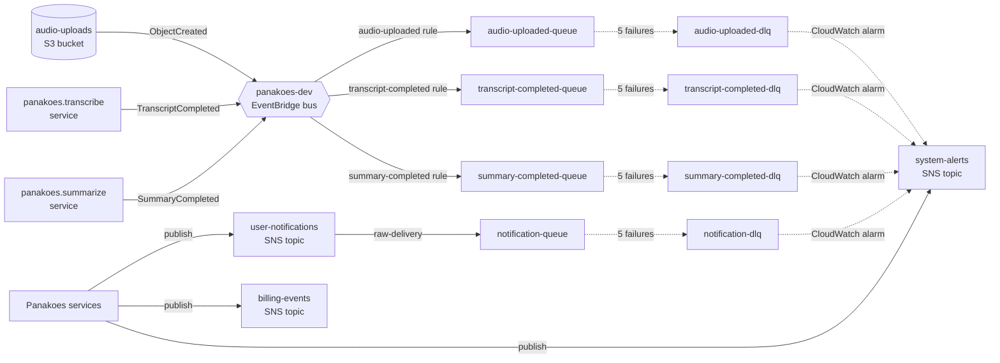

# Dev Environment Events

Per-environment Terraform configuration creating the async messaging
backbone of the Panakoes pipeline: a custom EventBridge bus, three
pipeline-stage rules, four SQS queues plus DLQs, three SNS fan-out
topics, and CloudWatch alarms on every DLQ. All SNS topics and SQS
queues are encrypted with a single dedicated CMK.

## Event flow

## What this creates

- **KMS CMK** `alias/panakoes-dev-events`. Single key shared across
  SNS topics and SQS queues in this module. 7-day deletion window;
  rotation enabled.
- **Custom EventBridge bus** `panakoes-dev`. Separate from the AWS
  default bus so Panakoes domain events have isolated routing and
  metrics.
- **EventBridge rules** (each targets the matching SQS queue):
  - `audio-uploaded`: matches `aws.s3` `Object Created` events
    where the bucket is the audio-uploads bucket from the
    `dev/storage` module's remote state.
  - `transcript-completed`: matches custom source
    `panakoes.transcribe`, detail-type `TranscriptCompleted`.
  - `summary-completed`: matches custom source `panakoes.summarize`,
    detail-type `SummaryCompleted`.
- **SNS topics** (KMS-encrypted; same-account publish only):
  - `panakoes-dev-system-alerts`: ops alert fan-out, including DLQ
    alarms from this module and any future runtime alarms.
  - `panakoes-dev-billing-events`: webhook fan-out for Stripe
    billing events.
  - `panakoes-dev-user-notifications`: user-facing notification
    fan-out; the notification queue subscribes to drive delivery.
- **SQS queues + DLQs** (KMS-encrypted; visibility 60s; retention 4
  days; redrive after 5 failed receives):
  - `audio-uploaded-queue` + `audio-uploaded-dlq`
  - `transcript-completed-queue` + `transcript-completed-dlq`
  - `summary-completed-queue` + `summary-completed-dlq`
  - `notification-queue` + `notification-dlq` (queue subscribed to
    `user-notifications` SNS topic with raw delivery)
- **CloudWatch alarms** (one per DLQ):
  - Fires when `ApproximateNumberOfMessagesVisible > 0` over a
    single 5-minute period.
  - Alarm and OK actions both publish to `system-alerts`.

## Apply

    cd infra/dev/events
    AWS_PROFILE=lafayettelabs terraform init
    AWS_PROFILE=lafayettelabs terraform plan
    AWS_PROFILE=lafayettelabs terraform apply

`terraform init` downloads the AWS provider and initializes the S3
backend (the bucket created by `infra/bootstrap/`). The remote state
lookup against `dev/storage` happens at plan time, so that config
must be applied first.

## How services consume this module

Downstream services (transcribe Lambda, summarize Lambda,
notification worker, ops alerting) read these resources' ARNs and
URLs via a `terraform_remote_state` data source pointing at this
config's state:

    data "terraform_remote_state" "events" {
      backend = "s3"
      config = {
        bucket = "panakoes-tf-state-b291597a"
        key    = "dev/events/terraform.tfstate"
        region = "us-east-1"
      }
    }

    # Then reference outputs as:
    #   data.terraform_remote_state.events.outputs.event_bus_arn
    #   data.terraform_remote_state.events.outputs.sqs_queue_urls["audio-uploaded-queue"]
    #   data.terraform_remote_state.events.outputs.sns_topic_arns["system-alerts"]
    #   data.terraform_remote_state.events.outputs.kms_key_arn

A consumer service must also be granted `kms:Decrypt` and
`kms:GenerateDataKey` against the events CMK ARN, otherwise reads
from the queue or publishes to a topic will fail with
`AccessDeniedException`.

## Design notes

**Why one CMK instead of one per topic/queue:** every consumer of
these messages sits inside the same Panakoes trust boundary. Granting
key access per-service is fine; isolating crypto material per-resource
buys little additional security at this stage and adds $1/month per
extra key. Revisit when a regulated workload joins the bus.

**Why a custom bus instead of the default bus:** rules on the default
bus route across every AWS service in the account. Mistakes there are
expensive (alarm storms, accidental Lambda triggers). A dedicated bus
scopes blast radius and keeps Panakoes-specific metrics clean.

**Why redrive after 5 failures:** matches Lambda's default async
retry (2 retries, then DLQ) plus a margin so transient downstream
issues self-heal without alerting. Tune downward for high-volume
streams.

**Why visibility timeout 60s:** long enough for typical consumers
(transcription metadata processing, audit writes, notification
formatting) to finish work and delete the message. Crashed consumers
redeliver fast; long-running stages should extend visibility per
message via `ChangeMessageVisibility` rather than raising the queue
default.

## Cost expectations

- KMS CMK: $1/month flat plus per-request charges. With bucket-key /
  topic-key amortization the per-request volume stays low.
- EventBridge custom bus: $1.00 per million published events; rules
  are free.
- SQS: $0.40 per million requests (free tier covers the first
  million per month). At dev volumes this is effectively free.
- SNS: $0.50 per million publishes plus per-subscription delivery
  charges (cheap for SQS endpoints).
- CloudWatch alarms: $0.10 per alarm per month, so $0.40/month total
  for the four DLQ alarms.

Aggregate dev-environment cost is dominated by the $1 KMS key.

## Outputs

| Output           | Type         | Purpose                                                  |
|------------------|--------------|----------------------------------------------------------|
| `event_bus_arn`  | string       | ARN of the custom EventBridge bus                        |
| `event_bus_name` | string       | Name of the custom EventBridge bus                       |
| `kms_key_arn`    | string       | ARN of the events CMK                                    |
| `sns_topic_arns` | map(string)  | name -> ARN for each SNS topic                           |
| `sqs_queue_urls` | map(string)  | logical name -> queue URL for live queues and DLQs       |
| `sqs_queue_arns` | map(string)  | logical name -> ARN for live queues and DLQs             |
